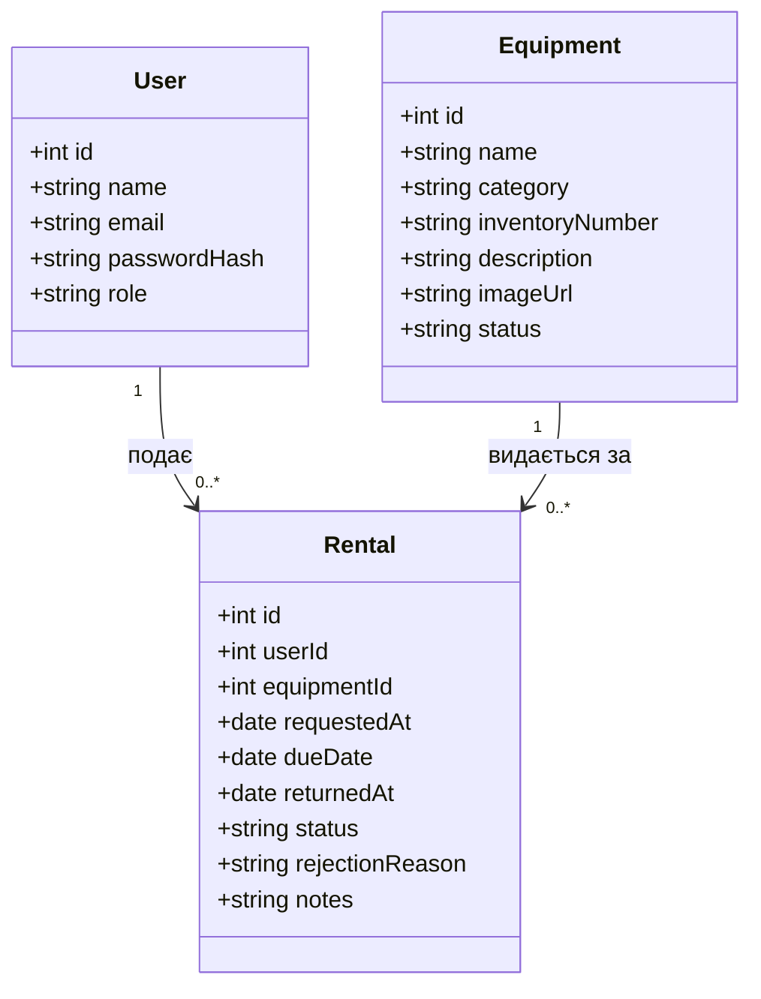

# Модель даних

## Обмеження
| Поле | Обмеження |
|---|---|
| User.email | UNIQUE, NOT NULL |
| User.role | CHECK: student, admin |
| Equipment.inventoryNumber | UNIQUE, NOT NULL |
| Equipment.category | CHECK: laptop, camera, sensor, other |
| Equipment.status | CHECK: available, rented, maintenance |
| Rental.status | CHECK: pending, approved, rejected, cancelled, returned |
| Rental.dueDate | CHECK: не раніше requestedAt |
| Rental.userId, equipmentId | FOREIGN KEY, NOT NULL |
| Rental.returnedAt, rejectionReason | можуть бути порожніми (NULL) |