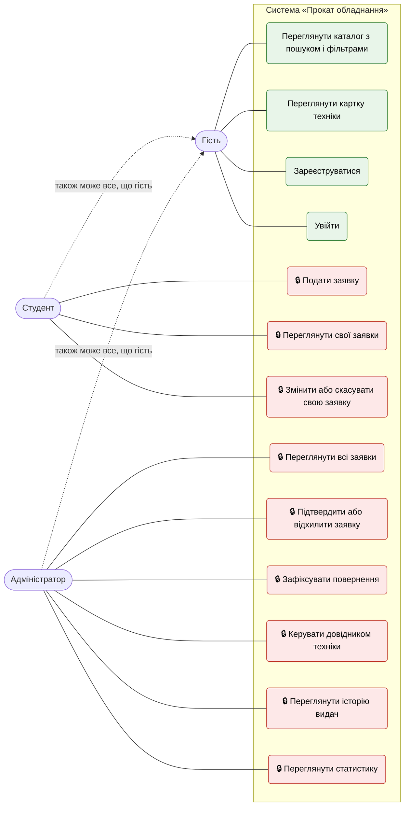

```mermaid
flowchart LR
    G([Гість])
    S([Студент])
    A([Адміністратор])

    subgraph SYS["Система «Прокат обладнання»"]
        direction TB
        UC1(Переглянути каталог з пошуком і фільтрами)
        UC2(Переглянути картку техніки)
        UC3(Зареєструватися)
        UC4(Увійти)

        UC5(🔒 Подати заявку)
        UC6(🔒 Переглянути свої заявки)
        UC7(🔒 Змінити або скасувати свою заявку)

        UC8(🔒 Переглянути всі заявки)
        UC9(🔒 Підтвердити або відхилити заявку)
        UC10(🔒 Зафіксувати повернення)
        UC11(🔒 Керувати довідником техніки)
        UC12(🔒 Переглянути історію видач)
        UC13(🔒 Переглянути статистику)
    end

    G --- UC1
    G --- UC2
    G --- UC3
    G --- UC4

    S -.->|також може все, що гість| G
    S --- UC5
    S --- UC6
    S --- UC7

    A -.->|також може все, що гість| G
    A --- UC8
    A --- UC9
    A --- UC10
    A --- UC11
    A --- UC12
    A --- UC13

    classDef auth fill:#fde8e8,stroke:#c0392b,color:#000
    classDef pub fill:#e8f5e9,stroke:#2e7d32,color:#000
    class UC5,UC6,UC7,UC8,UC9,UC10,UC11,UC12,UC13 auth
    class UC1,UC2,UC3,UC4 pub
```